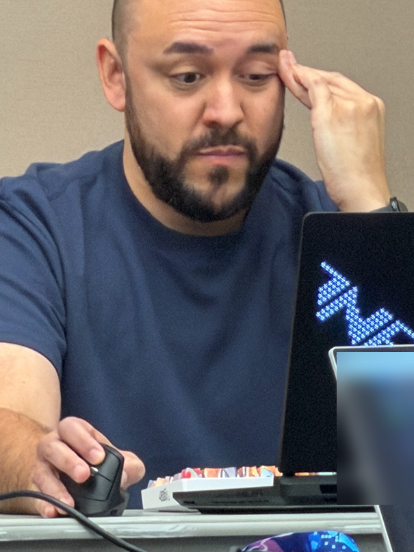

# 03 · Introduction to InfoStealers

**Lead:** Ryan

**Time:** 15 minutes

## Overview

So uh, what's an infostealer? That's what we'll be covering here.

This is a simple overview in which Ryan will discuss the topics below such that folks are aware of what infostealers are and will be ready to get hands-on in the next section to rip one apart :).

We're going to walk through two example papers on LummaC2. It's as simple as that.
- **Grab the two PDFs linked below, pop them open wherever you'd like, and let's boogie real quick.** Then we can get to the real fun!

## Topics

1. What an InfoStealer is and how the ecosystem has evolved.
2. What data modern stealers target and why.

## References

- [Lumma Stealer analysis paper](./Lumma_Stealer_Analysis.pdf)
- [LummaC2 overview paper](./LummaC2_stealer-Everything_you_need_to_know.pdf)

Only analyze the instructor-provided sample inside the workshop range.

---

Are you ready?! We're totally ready. I, Ryan, am totally ready. The following is for sure _not_ a picture of me moments before you all walked in the door, "finishing" my portion of the workshop. For sure.

---

[← Welcome](../02-lab-environment-setup/) · [Workshop home](../) · **[Next: Advanced Infostealer Analysis →](../04-advanced-infostealer-analysis/)**
