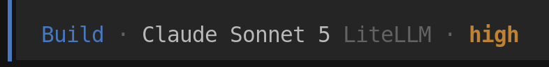

# Quick Triage — sample.exe

## AI Triage, eh Ryan?

AI can be useful for malware analysis. I find it the most useful for basic triage. In fact, that's what we have here. This was obtained via Sonnet 5 in High effort mode, proxied through LiteLLM in a separate REMnux install:

Let's review the little AI lovin', shall we?
- What's the most useful?
- What's confusing?
- What's perhaps wrong? Kinda wrong? Any outright hallucinations?!

## Sample Details

We will be analyzing a StealC v2 sample from the wild. The details of the sample we'll be reviewing follow:

SHA256: `6e3b874fca2800811b2cf343690bdd24638e13cafd4b949bffd44c2c12ea0609`
- SHA1: `2b0b32cfc652750d51eaa40cff3caadce12b7ff9`
- MD5: `602205faa44744b304e61fd62c849a3f`

[VirusTotal link](https://www.virustotal.com/gui/file/6e3b874fca2800811b2cf343690bdd24638e13cafd4b949bffd44c2c12ea0609/details)

From VirusTotal:
- Vhash: `075066655d555d055018z61jz1jz`
- Authentihash: `de88f60bb22154e4237889a2721ba3fc816271fb27665adf41bc4303e83f1810`
- Imphash: f456face36cfa724bf01290dd8927512`
- SSDEEP: `12288:3zvOznjd7Dkqya3OJXJyZzNP8GTop8mWVE8yxBlDetAqxSva:KXOqyzJXIPkEWRY3ybS`

## Triage Results

The data below was provided by Sonnet 5 and has _not_ been modified on purpose:

**Identity**
- SHA256: `6e3b874fca2800811b2cf343690bdd24638e13cafd4b949bffd44c2c12ea0609`
- MD5: `602205faa44744b304e61fd62c849a3f` | Imphash: `f456face36cfa724bf01290dd8927512`
- PE32+, x86-64, GUI subsystem, 6 sections (.text/.rdata/.data/.pdata/.fptable/.reloc)
- Compiled: MSVC 19.36.35220 / VS2022 17.6, LTCG/C++, debug build flag set, no packer detected (diec), entropy normal (~6.2)

**Attribution signal (unconfirmed, lead only)**
- YARA-forge hits: `MALPEDIA_Win_Stealc_Auto`, `CAPE_Stealcv2Datecheck`, `RUSSIANPANDA_Win_Mal_Stealc_V2`, plus a Chromium App-Bound-Encryption decrypter rule
- Debug/build-path artifact string: `C:\builder_v2\stealc\json.h` — a strong corroborating lead, but still just a string, not confirmed behavior
- Treat as "consistent with Stealc-family stealer," not confirmed attribution, until code-level behavior corroborates it

**Static import surface**
- Only ~99 imports, almost entirely KERNEL32 (CRT runtime plumbing) + a handful of ADVAPI32/SHLWAPI (`RegEnumKeyExA`, `StrChrA`)
- No WinINet/networking/crypto/registry-write APIs statically imported — but `GetProcAddress`+`LoadLibraryA` are imported, and I found a **dynamic import-resolution routine at `FUN_140040580`** that `LoadLibraryA`/`GetProcAddress`-resolves a large table of APIs at runtime, including the full WinINet set (`InternetOpenW`, `InternetConnectW`, `HttpOpenRequestW`, `HttpSendRequestW`, `InternetReadFile`, `InternetCrackUrlW`...), SHLWAPI (`StrStrA`/`StrChrA`), and ADVAPI32 registry functions (`RegEnumValueA`, `RegGetValueA`) — this is the resolver function worth walking students through, since it explains why the static import table looks so sparse.

**Capability signals found (code-backed, worth a walkthrough)**
- `FUN_1400423a8` — enumerates `Software\Martin Prikryl\WinSCP 2\Sessions` registry key via `RegEnumKeyExA`, pulls HostName/UserName/Password per session (WinSCP credential harvesting — classic stealer behavior, and code-reachable, not just a string).
- `FUN_140025c04` — RC4-style keystream/PRGA implementation (capa also flagged "encrypt data using RC4 PRGA").
- `FUN_140025da8` — custom Base64 encoder (capa: "encode data using Base64").
- `FUN_14000c508` — builds an `InternetOpenW`→`InternetConnectW`→`HttpOpenRequestW`(POST)→`HttpSendRequestW`(Content-Type: application/json)→`InternetReadFile` chain — i.e., an HTTP POST-to-server routine, called from several higher-level functions including one that assembles a Base64/RC4-processed blob first (`FUN_14002888c`, `FUN_14002b5a0`). This is the C2 exfil path.
- String at `1400ae390`: `\Google\Chrome\User Data\Local State` — browser-master-key-file artifact, consistent with Chromium credential/cookie theft, not yet traced to a code path in this session.
- Large block of Base64-looking strings around `0x140082a08`–`0x1400838e0` — likely obfuscated config/strings decoded via that Base64/RC4 pair at runtime; good candidate for a "decode this blob live" lab exercise.

**Notable non-findings**
- No literal C2 domain/URL strings in cleartext (consistent with the Base64/RC4 string-obfuscation scheme found)
- No clipboard, keylogging, screen-capture, or process-injection APIs statically imported (per `check_behavior_prerequisites`) — all fall into "possibly via dynamic resolution," same caveat as WinInet above.

## Discussion

Topics for discussion:
- 'Sup with that PDB/build path string? -> Is that an "answer"? Why is that there?
- Why so few imports? Where are all the API calls made?
- Those capabilities... are those in fact capabilities of the malware?
- **Overall:** How much can we trust this AI triage?

OK, enough of that. Let's load this sucker in Ghidra and get to it.

**[Next: Loading the Sample →](./02-loading-sample.md)**