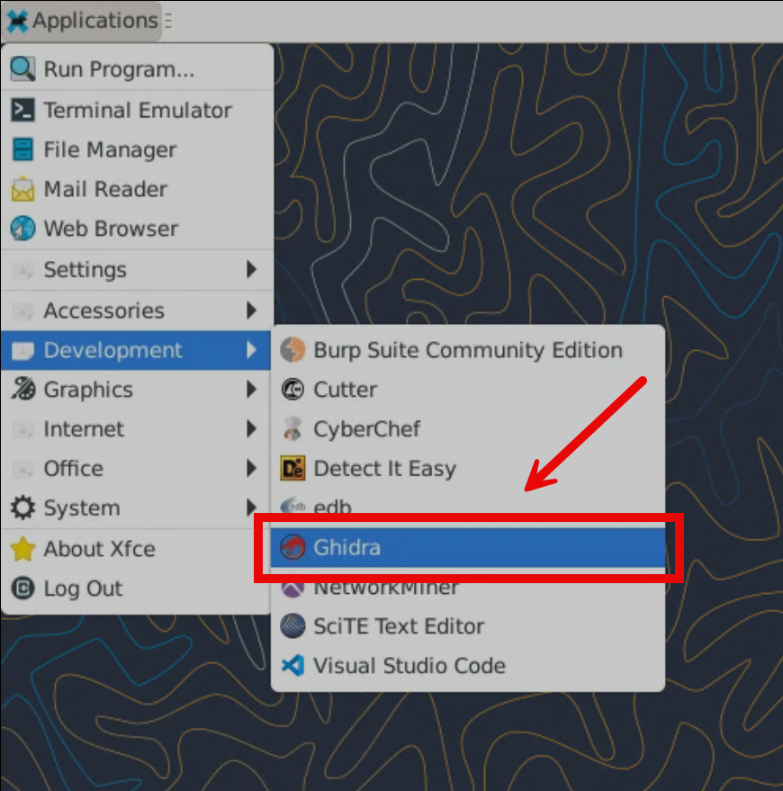
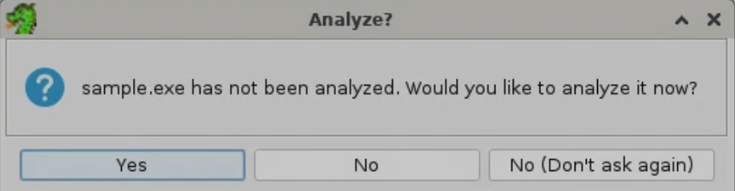
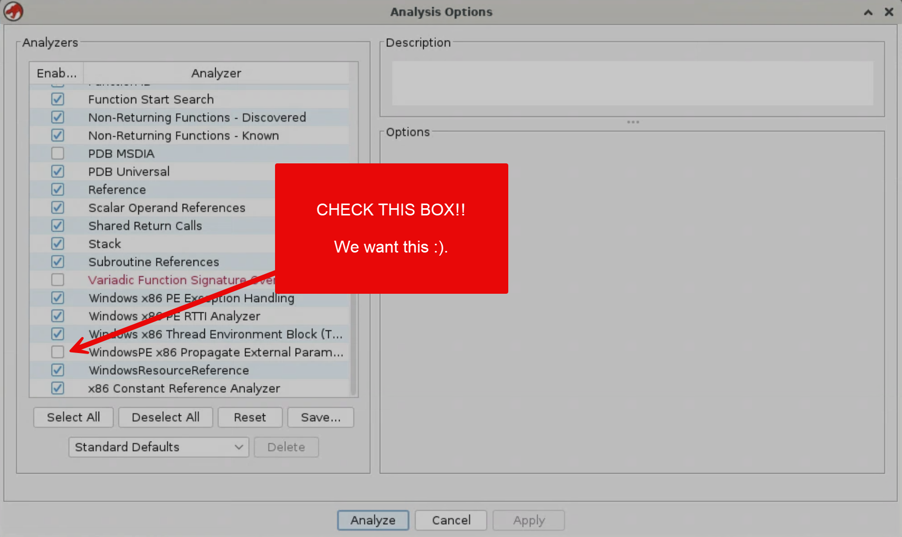

## Loading the Sample

OK, time to dig in!

Here we're going to load the sample into Ghidra.

-==--==--==--==--==--==--==--==--==--==--==--==--==--==--==--==--==--==--==-

**DISCLAIMER:** Some of the instructions in this and the following sections within the Advanced Infostealer Analysis module were AI generated. Duh. It's 2026. We're all a bit lazy. BUT: **This isn't an AI analysis workshop. This is a manual analysis workshop.** I just told AI what I wanted you to review in order to create these steps. I then edited the steps to be less "hey this fool genearted all this stuff with AI." Because, well, gross.

The steps are provided for folks in the workshop who may need them. The steps are furthermore provided such that folks outside the workshop running at DefCon 34 can participate. The bulk of the material will be Ryan having you move from one analysis point to another, losing his mind about something silly or stupid, going on tangents, etc. So anywho, just wanted to be up front about using some AI for step generation.

-==--==--==--==--==--==--==--==--==--==--==--==--==--==--==--==--==--==--==-

### 1. Launch Ghidra

1. From the REMnux desktop, open **Ghidra** (Applications menu → Development → Ghidra, or double-click the Ghidra icon if present). If you prefer the terminal, launching it directly also works:
   ```bash
   /opt/ghidra/ghidraRun
   ```



2. Wait for the **Ghidra Project Manager** window to appear. This is the project launcher — it's separate from the CodeBrowser (the actual disassembly/decompiler window), which opens later once a binary is imported.

### 2. Create a new project named "stealc"

3. In the Project Manager, go to **File → New Project**.
4. Select **Non-Shared Project** (a local project, not hosted on a shared repository server) and click **Next**.
5. For the project directory, use `/home/ubuntu/Documents/Ghidra` (create it if it doesn't exist).
6. For the project name, enter:
   ```
   stealc
   ```
7. Click **Finish**. You should now see an empty **stealc** project tree in the main window.

> **Note:** The project name is just a label for your Ghidra workspace — it does not need to match the sample's filename, and at this stage we haven't confirmed anything about the sample's actual family. We're using "stealc" here purely to keep the workshop's project organized, but keep in mind that any family name is a *lead to verify*, not a conclusion — you'll re-derive that conclusion yourself later through analysis, not from the project name.

### 3. Import the sample

8. With the **stealc** project open, go to **File → Import File...**.
9. Navigate to:
   ```
   /home/ubuntu/Documents/Malware/sample.exe
   ```
10. Ghidra will auto-detect the format and language. **Don't worry, we're going to use the defaults.** Confirm the following, and then just click **OK**:
    - **Format:** Portable Executable (PE)
    - **Language/Compiler:** `x86:LE:64:default`
    
   This may simply take a minute or two while the file imports. Once imported, you will see the `Import Results Summary` window.

11. Review the import summary dialog (shows sections, entry point, etc.) and click **OK** to dismiss it.
12. The imported `sample.exe` now appears in the project tree. Double-click that bad boy, `sample.exe`, to open it in the **CodeBrowser**.
   - __NOTE:__ If you double-click `sample.exe` and it doesn't load the Code Browser window after 5 seconds, which will be evident when you see a yellow dragon zoom in on the screen as the new window loads: Double-click the EXE again. WAIT DON'T DO THAT. Just kidding ;). Do it.

### 4. Run auto-analysis

13. When prompted **"Would you like to analyze it now?"**, click **Yes**.

   

14. On the analyze configuration screen, scroll down to the bottom until you see ``, AND CHECK THAT BOX! Hey. Hey you. Check that box! Then click **Analyze**.

   

15. Wait for analysis to finish — progress is shown in the bottom-right status bar. On a sample this size (~780 KB, ~1,800 functions), this may take several minutes. _Be patient._

At this point you should have `sample.exe` fully loaded and analyzed in the CodeBrowser, ready for the next section.

GREAT! You now have our malware sample loaded. Let's poke at it.

**[Next: Strings Attribution →](./03-strings-attribution.md)**