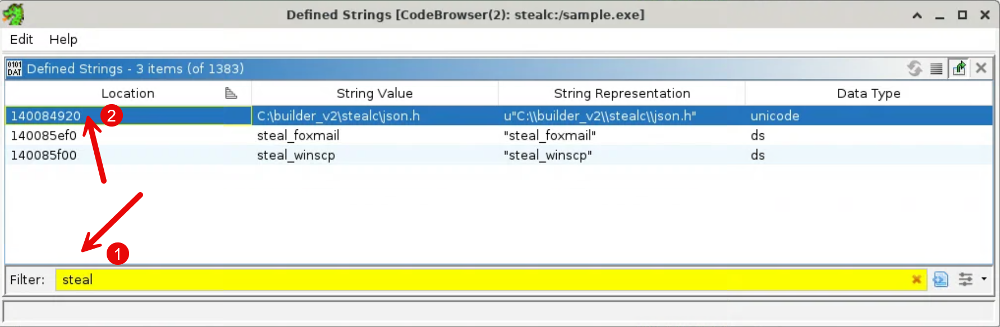
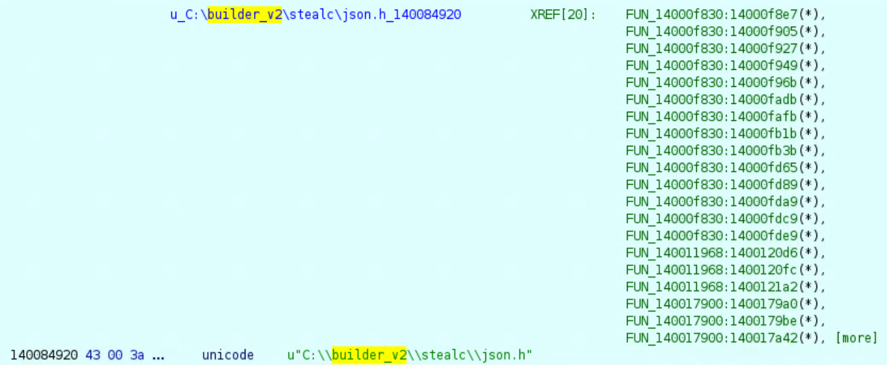

## Checking Strings

### 1. Open the Defined Strings window

1. In the CodeBrowser, go to **Window → Defined Strings**.
2. Click the **Location** column header to sort by address — this tends to group related strings together (e.g., an API name table sitting next to the DLL that owns it).
3. Scan the list for anything that hints at functionality. A few worth pausing on:

| Address | String | Why it matters |
|---|---|---|
| `1400872d0` | `wininet.dll` | Networking library — HTTP client capability |
| `14008e124` | `KERNEL32.dll` | Expected — base runtime |
| `14008e142` | `ADVAPI32.dll` | Registry / security APIs |
| `14008e15a` | `SHLWAPI.dll` | String helper APIs, often used by malware for lightweight parsing |
| `140087418` | `Software\Martin Prikryl\WinSCP 2\Sessions` | A registry key path — WinSCP stores saved server credentials here |
| `140087478` | `No WinSCP sessions found.` | A literal log/branch string — strong sign there's a code path that specifically checks for and reads WinSCP sessions |
| `140087550` | `soft\WinSCP\winscp.txt` | Another WinSCP-related path fragment |
| `1400ae390` | `\Google\Chrome\User Data\Local State` | The file Chromium stores its AES master key in — a classic ingredient for decrypting saved browser passwords/cookies |

4. Double-click any entry to jump to its address in the **Listing** view.
5. Right-click a string → **References → Show References to Address** to see what code actually touches it. This is the pivot that separates "string sitting in `.rdata`" from "string a function reads" — keep this habit for the rest of the workshop.

> **Note:** Defined Strings only shows what Ghidra's auto-analysis already typed as string data. It won't show every human-readable byte sequence in the binary — just what's been recognized so far. Goodie goodie, ty Ghidra!

### 2. Search the Defined Strings for "steal"

The Defined Strings table is a *curated* view. Good. Let's search it:

6. At the bottom of the Defined Strings window, type in `steal`. You will see 3 results.
7. In the `Location` column, click the first address, `140084920`, which is the location of the found string `C:\builder_v2\stealc\json.h`.

    

8. Go back to the Code Browser windoww, and you should see that you are now at address `140084920`. You will see the string identified.

    

### 3. Read this finding carefully — don't over-claim it

9. Look at the strings sitting near it in memory (scroll a little in the Listing, or check Defined Strings around that address) — you'll find things like `[json.exception.` and `map/set too long`. Those are error strings from an embedded JSON parsing library (e.g., nlohmann/json), and `builder_v2\stealc\json.h` is that library's *source file path* as it existed on the developer's build machine when they compiled it in.
10. What this string is:
    - A **leftover compiler/debug build path** — it tells you about the developer's build environment, not runtime behavior.
    - The `stealc` path segment resembles the known **Stealc** infostealer family name — a real, notable lead.
11. What this string is **not**:
    - It is not proof the binary performs any particular behavior.
    - The word "steal" appearing here is incidental to the JSON library's folder structure, not a functional stealer string on its own.
    - Family attribution should not rest on this string alone — it needs corroboration from imports, decompiled behavior, or other independent evidence before you'd call it a finding rather than a lead.

12. Keep this address (`140084920`) and the WinSCP strings (`140087418`) in your notes — both will come up again once we start tracing code in the next section.

**[Next: Strings Decoding →](./04-strings-decoding.md)**