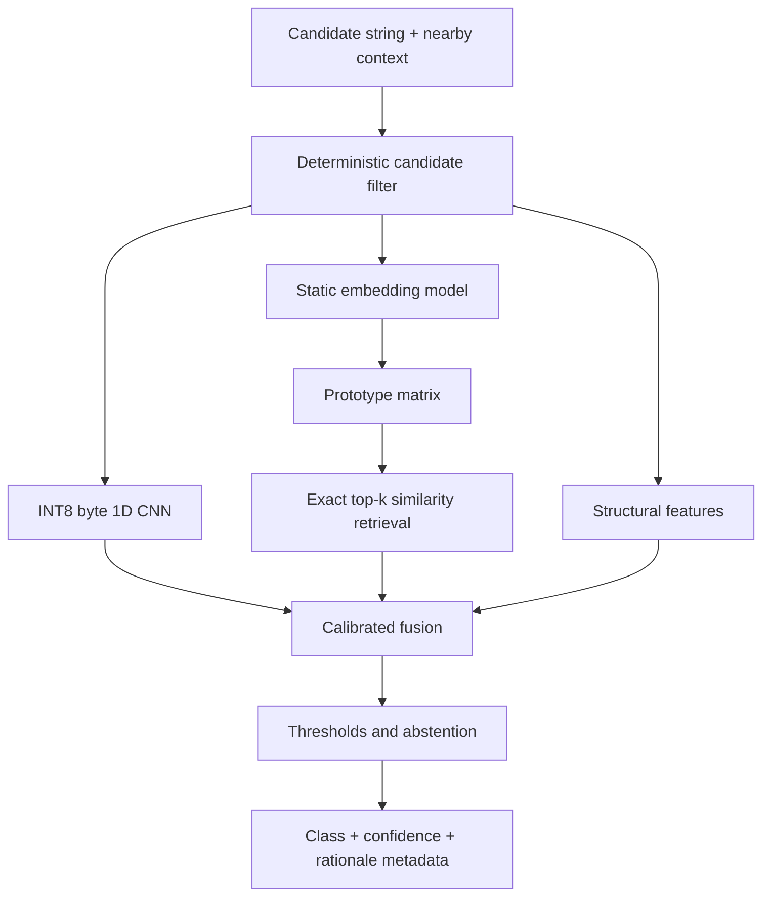

# Hybrid Prototype-Augmented Edge Classifier

## Concept, component taxonomy, and research model

**Status:** Research design  
**Last validated:** 2026-08-07  
**Intended use:** Defensive classification over lab-generated records and other
local records deliberately selected for research.

This document describes the mental model behind a compact local classifier that combines:

- A quantized byte/character 1D convolutional neural network.
- A static text-embedding model.
- A labeled prototype matrix.
- Deterministic structural features.
- A small fusion and policy layer.

The most accurate name for the complete capability is:

> **Hybrid prototype-augmented edge classifier**

“Retrieval-augmented classifier” and “hybrid neural and exemplar-based classifier” are also accurate. It is not traditional generative RAG because retrieval feeds a classification decision rather than a language model.

## Research boundary

The laboratory version should accept records from a supplied file, standard
input, test API, or an opt-in crawl of one user-selected local root. Within
that selected lab root, it may inspect all regular UTF-8 files—including hidden
and key/certificate-named fixtures—but it must not add source-specific browser,
wallet, registry, process, remote-system, or unrelated-outside-root discovery.
It should not contain persistence, evasion, execution, or exfiltration
functions. Network access should be disabled at runtime.

This boundary still supports the important research questions: model accuracy, false-positive behavior, package size, inference speed, calibration, cross-platform operation, and generalization to unseen templates.

## The complete mental model



The CNN, embedding model, and prototype matrix are not three competing models. They are different categories of component that contribute complementary evidence.

| Component | Correct classification | Primary job | Mental analogy |
|---|---|---|---|
| INT8 1D CNN | Quantized supervised discriminative neural model | Recognize lexical and structural patterns in raw bytes | Fast pattern recognition |
| Static embedding model | Representation model or encoder | Convert context into a semantic vector | Translator into coordinates |
| Prototype matrix | Labeled vector-memory artifact | Store representative examples and category knowledge | Long-term exemplar memory |
| Similarity search | Retrieval algorithm | Recall prototypes nearest to the new context | Remembering similar experiences |
| Deterministic features | Symbolic evidence layer | Measure exact structural facts | Checklist and instruments |
| Fusion model | Calibrated decision model | Combine evidence from all paths | Judgment |
| Policy layer | Decision policy | Apply thresholds, abstention, and allowed actions | Rules of engagement |
| Governance artifacts | Versioning and evaluation controls | Make results reproducible and auditable | Chain of custody |

## 1. Candidate and context record

The input is one lab record containing at least:

```text
candidate: the raw string being classified
context:   key name, line, or nearby text that explains how it is used
source:    optional fixture or dataset reference when useful
```

The candidate and its context serve different purposes:

- The candidate carries morphology: delimiters, prefixes, length, character distribution, encodings, and token shape.
- The context carries meaning: assignment names, surrounding configuration text, comments, and whether the value is an example or active-looking artifact.

The system should preserve that separation. The CNN consumes the candidate. The embedding path primarily consumes a normalized context envelope containing the key name, line, and limited nearby text.

## 2. INT8 byte/character 1D CNN

### Full classification

> **Quantized, supervised, discriminative, byte-level neural classifier.**

It learns local patterns without a heavyweight tokenizer. It can recognize combinations of:

- Prefixes and suffixes.
- Separators and assignment syntax.
- Length and character distributions.
- Encoded-looking fragments.
- Structured formats.
- Token morphology that would be tedious to enumerate as rules.

“INT8” describes the deployment representation of weights and operations. It reduces size and can improve CPU performance on supported hardware. It does not change the model’s conceptual category.

### Practical starting architecture

| Layer | Suggested initial configuration |
|---|---|
| Input | 256 or 512 UTF-8 bytes, padded or truncated |
| Vocabulary | 256 byte values plus a padding value |
| Byte embedding | 16 dimensions |
| Parallel convolutions | Widths 2, 3, 4, and 5; 64 filters per width |
| Pooling | Global maximum and global mean |
| Dense layer | 64 units with dropout during training |
| Primary output | Three-class softmax |
| Optional auxiliary output | Artifact-family label |

That exact single-convolution configuration is approximately 52,000 trainable parameters, or roughly 52 KB of raw INT8 weights before model-container overhead. The inference runtime will dominate the deployed package size.

### What the CNN is good at

- Isolated or short strings.
- Previously unseen identifiers with familiar morphology.
- Character-level evidence that semantic models may ignore.
- Fast fixed-cost local inference.

### What it cannot know reliably

- Whether an arbitrary high-entropy string is a credential, hash, checksum, public identifier, or test fixture.
- Whether the value is active.
- Whether surrounding code makes the value benign.
- The operational significance of a value without context.

This limitation is the reason for the semantic retrieval and policy paths.

## 3. Static embedding model

### Full classification

> **Pretrained static representation model used to encode contextual text.**

It maps a context envelope to a fixed-length vector. It does not search, store prototypes, generate text, or make the final decision.

Static embeddings are attractive here because their runtime is essentially tokenization, embedding-table lookup, weighted aggregation, and normalization. They are much smaller than transformer encoders, although they are also less context-sensitive.

The initial model candidates are from the POTION/Model2Vec family:

| Model | Approximate parameter count | Suggested use |
|---|---:|---|
| `potion-base-2M` | 1.8M | Default footprint baseline |
| `potion-base-4M` | 3.7M | Accuracy/size comparison |
| `potion-base-8M` | 7.5M | Larger compact comparison |
| `potion-code-16M` | 16M | Optional code/configuration-focused experiment |

The model choice must be benchmarked on the actual synthetic corpus. “Bigger” should not automatically win; package size, cold-start time, and performance on unseen templates are first-class metrics.

## 4. Prototype matrix

### Full classification

> **A labeled vector-memory artifact, exemplar store, or prototype knowledge base.**

If the embedding dimension is \(d\), the prototype matrix is:

\[
P =
\begin{bmatrix}
p_1 \\
p_2 \\
\vdots \\
p_n
\end{bmatrix}
\in \mathbb{R}^{n \times d}
\]

Each row represents one normalized, labeled prototype. Associated metadata should include:

```text
prototype_id
class_label
artifact_family
short_description
dataset_and_version
encoder_id
optional_weight
```

Example prototype categories include:

- Synthetic sensitive-looking configuration.
- Placeholder or documentation example.
- Checksum or file hash.
- Public identifier.
- Connection-string-shaped test fixture.
- Ordinary application configuration.
- Random or encoded benign content.

The matrix is not itself a trained AI model. It is data encoded in the coordinate system defined by the embedding model. Changing the embedding model invalidates the matrix unless every prototype is re-embedded.

### Why a flat matrix is the initial recommendation

For a few thousand prototypes, exact similarity search is simple and usually smaller than an approximate-nearest-neighbor index. With normalized vectors, cosine similarity is equivalent to a dot product:

\[
\operatorname{similarity}(z,p_i) = z \cdot p_i
\]

An INT8 matrix can remain compact:

| Prototype count | 128 dimensions | 384 dimensions |
|---:|---:|---:|
| 1,000 | 128 KB | 384 KB |
| 5,000 | 640 KB | 1.92 MB |
| 10,000 | 1.28 MB | 3.84 MB |

These figures cover vector bytes only, before scales and metadata. A vector database is optional infrastructure, not an essential part of the intelligence.

## 5. Similarity retrieval

The retrieval algorithm performs five operations:

1. Encode the context with the static model.
2. Normalize the query vector.
3. Compare it with all prototype rows.
4. Select the top \(k\) matches.
5. Aggregate similarity evidence by class and artifact family.

The retrieval result should contain more than the single nearest neighbor. Useful evidence includes:

- Highest similarity.
- Similarity-weighted vote per class.
- Margin between the best and second-best classes.
- Agreement among the top \(k\).
- Prototype diversity and optional source metadata.

An approximate index such as USearch becomes worth testing only after profiling shows that an exact scan is a bottleneck or the matrix grows substantially.

## 6. Deterministic feature layer

Rules should add interpretable evidence and reduce unnecessary inference. Suggested non-secret-specific features include:

- Candidate length.
- Shannon entropy estimate.
- Ratios of digits, letters, punctuation, and non-ASCII bytes.
- Repeated-character and low-diversity indicators.
- Assignment or delimiter structure.
- UUID-, digest-, or encoding-like shape.
- Placeholder words in context.
- Whether the candidate exactly appears in surrounding context.

Rules should not silently dictate the final label except for deliberately defined high-precision cases. Their outputs should be visible to the fusion layer and report.

## 7. Fusion and calibration

The three main evidence paths answer different questions:

| Evidence path | Question answered |
|---|---|
| CNN | What does this candidate structurally resemble? |
| Retrieval | What labeled contexts resemble this context? |
| Rules/features | What exact measurable facts are present? |

A small multinomial logistic-regression model is an appropriate initial fusion layer:

\[
\mathbf{s} = W\mathbf{x} + \mathbf{b}
\]

where \(\mathbf{x}\) contains CNN probabilities, retrieval evidence, and deterministic features. A softmax produces class probabilities. Calibration should be performed on a held-out calibration split, not the training set.

The fusion layer should expose:

- Per-class calibrated probability.
- Top contributing evidence groups.
- Retrieval agreement and margin.
- Model and prototype versions.
- Whether the decision passed policy thresholds or abstained.

## 8. Decision policy and abstention

The model’s score is not the policy. The policy converts evidence into an allowed outcome.

Recommended primary classes:

| Class | Meaning |
|---|---|
| `sensitive_like` | Resembles an active sensitive artifact in the lab research taxonomy |
| `placeholder_or_test` | Resembles documentation, fixture, weak/example, or intentionally synthetic data |
| `benign_other` | Resembles ordinary identifiers, hashes, random data, or unrelated content |
| `abstain` | Evidence is weak, novel, or contradictory; manual review is required |

An optional second output can classify artifact family independently. Keeping “sensitive-like” separate from “known active” is important: the local classifier generally cannot establish validity.

Abstention should trigger when:

- Maximum calibrated probability is below a threshold.
- The top two classes are too close.
- CNN and retrieval strongly disagree.
- Retrieval similarity is below an out-of-distribution threshold.
- The record violates the input contract.

## 9. Structured explanation without a generator

A generative model is unnecessary for the core classifier. Deterministic rationale metadata is smaller and more reliable:

```json
{
  "class": "placeholder_or_test",
  "confidence": 0.93,
  "candidate_fingerprint": "sha256:...",
  "cnn": {"top_class": "sensitive_like", "probability": 0.61},
  "retrieval": {"top_class": "placeholder_or_test", "agreement": 0.88},
  "features": ["assignment_context", "placeholder_language"],
  "decision": {"abstained": false, "policy_version": "policy-001"},
  "artifacts": {"bundle_version": "bundle-001"}
}
```

Raw candidates should be omitted from logs and reports by default. A keyed or ordinary hash can support test correlation without copying potentially sensitive material into telemetry.

## The larger capability taxonomy

A “next-generation” compact local classifier contains six functional categories:

1. **Perception:** the CNN recognizes low-level byte and character patterns.
2. **Representation:** the static model converts contextual language into vectors.
3. **Memory:** the prototype matrix stores labeled experience.
4. **Retrieval and symbolic evidence:** nearest-neighbor search recalls examples while features establish exact facts.
5. **Judgment:** fusion, calibration, policy, and abstention produce a controlled result.
6. **Governance:** artifact manifests, optional source metadata, benchmarks, drift tests, and privacy controls make the result dependable.

This taxonomy is reusable beyond defensive string classification. The same
pattern can classify local telemetry, configuration snippets, log lines, or
other short structured artifacts when supplied through an explicit input or
user-selected local-root boundary.

## Research experiment

Build and compare three progressively richer systems:

1. Character n-gram hashing plus logistic regression.
2. Quantized byte 1D CNN.
3. CNN plus static embeddings, prototype retrieval, deterministic features, and calibrated fusion.

Measure:

- Recall at fixed false-positive rates such as \(10^{-3}\) and \(10^{-4}\).
- Precision-recall AUC and macro F1.
- Per-class confusion, especially placeholder versus sensitive-like.
- Expected calibration error and abstention quality.
- Performance on unseen templates, projects, and languages.
- Cold-start latency, steady-state latency, peak memory, and throughput.
- Model, matrix, runtime, and final package size.
- Accuracy difference between FP32 and INT8 artifacts.

Use grouped, template-held-out, repository-held-out, or chronological splits. A random row split can leak near-duplicate templates into train and test sets and produce unrealistically strong results.

## What this architecture is not

- It is not a local LLM.
- It is not a generative RAG pipeline.
- It does not require a vector database at small scale.
- The prototype matrix is not a model.
- INT8 is not a separate type of intelligence; it is a deployment representation.
- Similarity is evidence, not proof.
- A high-confidence result does not prove a credential is valid or active.

## Research basis and implementation references

- Saxe and Berlin, [eXpose: A Character-Level Convolutional Neural Network with Embeddings for Detecting Malicious URLs, File Paths and Registry Keys](https://arxiv.org/abs/1702.08568).
- Baby et al., [Separating Secrets from Placeholders: A Hybrid CNN-CodeBERT Framework for Three-Class Credential Leakage Detection](https://arxiv.org/abs/2605.31520).
- Raff et al., [Malware Detection by Eating a Whole EXE](https://arxiv.org/abs/1710.09435). This is useful raw-byte background, but its whole-binary architecture is not the recommended short-string model.
- MinishLab, [Model2Vec Rust implementation and POTION model catalog](https://github.com/MinishLab/model2vec-rs).
- MinishLab, [`potion-base-2M` model card](https://huggingface.co/minishlab/potion-base-2M).
- Microsoft, [ONNX Runtime quantization guidance](https://onnxruntime.ai/docs/performance/model-optimizations/quantization.html).
- Pyke, [`ort` Rust binding documentation](https://docs.rs/ort/latest/ort/).
- Sonos, [`tract` self-contained inference runtime](https://github.com/sonos/tract).
- Unum Cloud, [USearch vector-search engine](https://github.com/unum-cloud/usearch).
