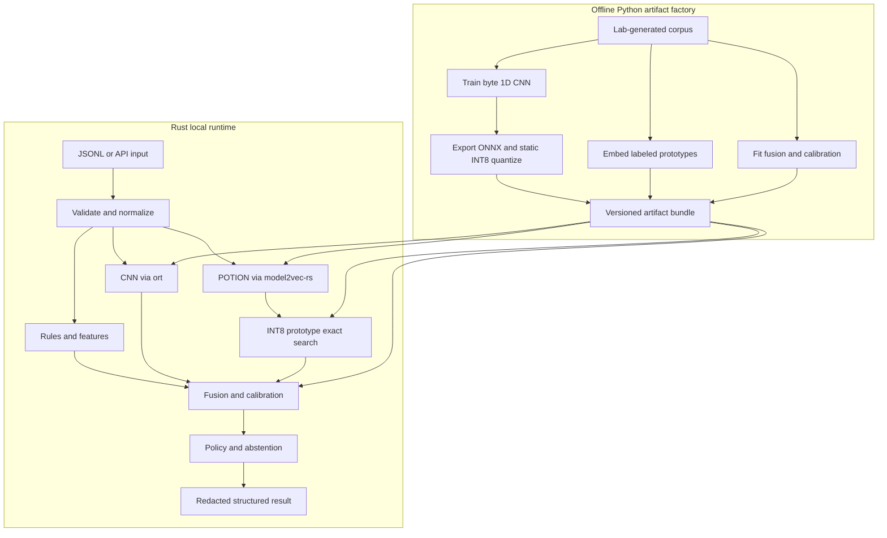

# Rust Reference Architecture and Codex Build Guide

## Hybrid prototype-augmented edge classifier

**Status:** Recommended starting architecture  
**Last validated:** 2026-08-07  
**Deployment target:** Local Windows, Linux, and macOS classifier  
**Runtime principle:** No network dependency; classify explicit lab records and
records collected from one user-selected local root.

## Executive recommendation

Rust is a strong runtime and packaging language for this capability. The recommended split is:

> **Train, export, quantize, calibrate, and build artifacts in Python. Deploy inference, retrieval, fusion, policy, and reporting in Rust.**

Start with:

- PyTorch for training the byte 1D CNN.
- ONNX Runtime’s Python tools for static INT8 quantization.
- The Rust `ort` crate for CNN inference.
- `model2vec-rs` with `potion-base-2M` for contextual embeddings.
- A custom row-major INT8 prototype matrix and exact top-\(k\) scan.
- Native Rust multinomial logistic regression for fusion.
- Native Rust thresholds, abstention, schema validation, and structured reporting.
- `include_bytes!()` or a signed/versioned adjacent artifact bundle, depending on release strategy.

Do not begin with a vector database, a local LLM, custom CNN inference, or a complex service. Establish a correct, measured CLI first.

## Recommended architecture



## Technology decisions

| Layer | First implementation | Why | Revisit when |
|---|---|---|---|
| CNN training | PyTorch | Fast research iteration and reliable ONNX export | A different training framework is already standard internally |
| CNN quantization | ONNX Runtime static QDQ INT8 | Official guidance favors static quantization for CNNs | Accuracy loss or target runtime requires another format |
| Rust CNN inference | `ort` | Mature ONNX Runtime binding and broad operator support | Package size is proven to be a release blocker |
| Static embeddings | `model2vec-rs` + `potion-base-2M` | Official Rust implementation, in-memory loading, compact model | Held-out accuracy favors 4M, 8M, or code-16M enough to justify size |
| Prototype storage | Custom row-major `Vec<i8>` plus metadata | Small, deterministic, easy to embed and audit | Corpus size or update requirements make exact scan inadequate |
| Retrieval | Exact dot products + top-\(k\) | Simple and correct baseline | Profiling shows retrieval dominates latency |
| Large retrieval option | USearch | Rust support, persistence, filtering, ANN capability | Prototype count grows substantially |
| Fusion | Native multinomial logistic regression | Tiny, explainable, portable | A nonlinear model materially improves held-out results |
| Policy | Native Rust thresholds and abstention | Clear separation between prediction and action | Never merge policy invisibly into training |
| First interface | JSONL CLI | Reproducible, scriptable, easy to benchmark | Core library is stable and another interface is justified |
| Alternative runtime | `tract` | Self-contained Rust and potentially smaller packaging | The exact quantized CNN graph passes compatibility and parity tests |

Microsoft’s current guidance recommends static quantization for CNNs and describes QDQ and operator-oriented representations. Begin with S8S8 QDQ, then measure accuracy and target CPU behavior. Do not assume quantization improves performance on every processor.

## Why Rust fits

- Memory-safe native parsing and feature extraction.
- Predictable CPU and memory usage.
- Straightforward cross-platform CLI and library packaging.
- Easy embedding of immutable artifacts with `include_bytes!()`.
- Strong support for concurrency without requiring it in the first version.
- No Python interpreter in the deployed runtime.
- Clear data types for enforcing contract, dimensionality, and policy invariants.

The primary caveat is that ONNX Runtime is a native dependency. The first release may be an executable plus an ONNX Runtime library rather than a literal single file. Optimize that only after the classifier is correct and benchmarked.

## Component design

### 1. Input contract

Use JSON Lines so each record is independently testable:

```json
{"record_id":"fixture-0001","candidate":"synthetic-example-value","context":{"key":"service_token","line":"service_token = synthetic-example-value","before":[],"after":[]},"source":{"dataset":"generated-v1","authorization":"synthetic"}}
```

The `source` object above illustrates the frozen Phase 0 compatibility format.
Outside that format, source metadata is optional; Stage 01 collection has its
own versioned contract.

Enforce limits before inference:

- Maximum candidate byte length.
- Maximum context bytes and number of lines.
- Valid UTF-8 handling policy; the CNN itself operates on bytes.
- Optional source and dataset metadata when useful for repeatability.
- No paths or implicit discovery instructions in the initial input schema.

### 2. Preprocessing

Create one canonical preprocessing specification used by Python and Rust:

- Byte truncation and padding direction.
- Padding value and vocabulary mapping.
- Unicode normalization for semantic context.
- Whitespace and line-ending normalization.
- Context-envelope template.
- Feature definitions and numerical ranges.

Generate golden fixtures in Python and assert byte-for-byte parity in Rust. Preprocessing drift is one of the easiest ways to ship a model that appears healthy but behaves incorrectly.

### 3. CNN artifact

Recommended initial graph:

```text
byte ids [batch, 512]
  -> embedding(257, 16)
  -> parallel Conv1D widths 2/3/4/5, 64 filters each
  -> global max + global mean pooling
  -> dense(64) + ReLU
  -> logits(3)
```

Training order:

1. Train the FP32 model.
2. Export a fixed-shape ONNX model.
3. Validate ONNX output parity against PyTorch.
4. Run ONNX preprocessing separately.
5. Static-quantize with a representative calibration subset.
6. Validate INT8 parity and class-level metrics.
7. Record graph hash, opset, input/output names, and required operators.

Do not hard-code a crate or ONNX version in design documents. Pin compatible versions in `Cargo.lock`, the Python lockfile, and the artifact manifest at implementation time.

### 4. Static embedding artifact

Use `model2vec-rs` and load the tokenizer, model weights, and configuration from memory. `potion-base-2M` is the footprint baseline; compare larger variants only through held-out measurements.

The encoder output dimension must come from the artifact and be asserted against the prototype-matrix header. The runtime must refuse to load a matrix created by a different encoder identifier or preprocessing version.

### 5. Prototype bundle

Use a deterministic binary format with a small header and row-major vector data:

```text
magic
format_version
bundle_version
encoder_id
preprocessing_version
dimensions
prototype_count
quantization_method
matrix_sha256
metadata_sha256
matrix: prototype_count × dimensions × int8
per-vector scales: prototype_count × float32
metadata: versioned JSON or compact binary records
```

For each normalized FP32 prototype vector \(p\), use a documented per-vector symmetric scale:

\[
s_p = \frac{\max_i |p_i|}{127}, \qquad q_i = \operatorname{round}(p_i/s_p)
\]

Quantize the normalized query in the same manner. Accumulate INT8 products into `i32` and rescale the result. Test approximation error against FP32 cosine similarity before accepting the format.

### 6. Exact retrieval

Start with a cache-friendly row-major scan:

```text
for each prototype row:
    score = int8_dot(query, row) * query_scale * row_scale
maintain top-k results
aggregate score by class and artifact family
```

Use a bounded top-\(k\) heap or partial selection. Keep a scalar reference implementation and compare any SIMD optimization against it. Only add USearch after a benchmark demonstrates need.

### 7. Feature extraction

Implement deterministic features in a pure Rust module with golden tests. Suggested features:

- Byte length and normalized length.
- Entropy estimate.
- Character-class ratios.
- Repetition and diversity.
- Assignment and delimiter evidence.
- Encoding-, digest-, and identifier-like shapes.
- Placeholder or documentation language in context.

The feature vector needs a versioned ordered schema. Changing feature order without changing the fusion artifact version must fail tests.

### 8. Fusion and calibration

Fit a multinomial logistic-regression model in Python over out-of-fold branch outputs. Do not fit it on in-sample CNN predictions.

Suggested fusion inputs:

- Three CNN class probabilities or logits.
- Retrieval class votes.
- Highest similarity and top-\(k\) agreement.
- Best-versus-second class margin.
- Selected deterministic features.
- Missing-context indicator.

Serialize:

```text
feature_schema_version
class_order
weight_matrix
bias_vector
temperature_or_calibration_parameters
training_dataset_version
metrics_summary
```

Implement the forward pass directly in Rust. Validate output parity against a Python golden set.

### 9. Policy and reporting

Prediction and policy must remain separate. Policy consumes calibrated class probabilities and evidence quality, then emits:

- `sensitive_like`
- `placeholder_or_test`
- `benign_other`
- `abstain`

Do not log raw candidates by default. Return a fingerprint, lengths, class, calibrated confidence, branch evidence, prototype IDs, and artifact versions. Add an explicit debug flag for fixture-only raw output and reject it in release builds if feasible.

## Artifact manifest

Every release bundle should contain a signed or checksummed manifest similar to:

```yaml
bundle_version: bundle-001
created_utc: 2026-08-05T00:00:00Z
classes:
  - sensitive_like
  - placeholder_or_test
  - benign_other
preprocessing_version: preprocess-001
cnn:
  file: cnn-int8.onnx
  sha256: REPLACE_AT_BUILD
  input_name: byte_ids
  input_shape: [-1, 512]
  output_name: logits
embedding:
  model_id: minishlab/potion-base-2M
  local_only: true
prototypes:
  format_version: 1
  dimensions: DERIVE_AT_BUILD
  count: DERIVE_AT_BUILD
fusion:
  file: fusion.json
  feature_schema_version: fusion-features-001
policy:
  file: policy.json
  version: policy-001
data:
  source_metadata: optional
  runtime_discovery: false # Phase 0 JSONL runtime only
  network_access: false
```

## Suggested repository structure

```text
hybrid-edge-classifier/
├── AGENTS.md
├── README.md
├── SECURITY.md
├── Cargo.toml
├── Cargo.lock
├── pyproject.toml
├── uv.lock
├── justfile
├── crates/
│   ├── classifier-core/
│   │   └── src/
│   │       ├── input.rs
│   │       ├── preprocess.rs
│   │       ├── features.rs
│   │       ├── cnn.rs
│   │       ├── embedding.rs
│   │       ├── prototypes.rs
│   │       ├── retrieval.rs
│   │       ├── fusion.rs
│   │       ├── policy.rs
│   │       └── report.rs
│   └── classifier-cli/
│       └── src/main.rs
├── python/
│   ├── data/
│   ├── baselines/
│   ├── train_cnn.py
│   ├── export_onnx.py
│   ├── quantize_onnx.py
│   ├── build_prototypes.py
│   ├── fit_fusion.py
│   └── build_manifest.py
├── schemas/
│   ├── input.schema.json
│   ├── output.schema.json
│   └── manifest.schema.json
├── artifacts/
│   └── README.md
├── tests/
│   ├── fixtures/
│   ├── golden/
│   └── integration/
├── benchmarks/
└── docs/
```

Do not commit licensed model files or large generated artifacts until their license, source, checksum, and intended distribution path are documented.

## Build sequence

### Phase 0: safety and contracts

- Write `SECURITY.md`, input/output schemas, data policy, and non-goals.
- Establish synthetic fixture generation.
- Prohibit implicit/system-wide runtime discovery and network access; allow a
  separately versioned Stage 01 crawl of one user-selected local root.
- Define labels, artifact families, and abstention semantics.

**Exit gate:** Schema tests pass and every test record is lab-contained;
optional source metadata is recorded where useful for repeatability.

### Phase 1: deterministic baseline

- Implement normalization and features in Python and Rust.
- Train character n-gram hashing plus logistic regression.
- Establish the evaluation harness and grouped splits.

**Exit gate:** Reproducible baseline report with false-positive operating points.

### Phase 2: FP32 CNN

- Train the byte CNN.
- Export ONNX.
- Run it through Rust `ort`.
- Add Python/Rust parity tests.

**Exit gate:** Maximum agreed numerical tolerance and identical class decisions on golden fixtures.

### Phase 3: INT8 CNN

- Calibrate and static-quantize.
- Compare FP32 and INT8 metrics, latency, and size.
- Preserve both artifacts during evaluation.

**Exit gate:** Quantization degradation stays within a predeclared tolerance.

### Phase 4: static embedding and prototypes

- Integrate `model2vec-rs` locally.
- Build prototypes using the exact same encoder and context template.
- Implement FP32 retrieval first, then INT8 matrix retrieval.

**Exit gate:** Rust and Python agree on top-\(k\) IDs and scores within tolerance.

### Phase 5: fusion and abstention

- Produce out-of-fold branch predictions.
- Fit fusion and calibration artifacts.
- Implement policy thresholds and abstention.

**Exit gate:** Calibration and placeholder confusion improve over the CNN-only baseline on held-out groups.

### Phase 6: packaging

- Bundle immutable artifacts.
- Add hash and compatibility checks.
- Build Windows, Linux, and macOS packages.
- Measure cold start, memory, throughput, and total size.

**Exit gate:** Runtime works offline and rejects incompatible or modified artifacts.

### Phase 7: optimization experiments

- Test a reduced ONNX Runtime build.
- Test `tract` only with the exact exported graph.
- Test hand-written/AOT CNN inference only if package size warrants it.
- Test USearch only if exact retrieval is a measured bottleneck.

**Exit gate:** An optimization replaces the baseline only when parity and benchmark gains are documented.

## Test matrix and acceptance criteria

| Area | Required checks |
|---|---|
| Data | Lab-generation/source-metadata checks, duplicate detection, template-group leakage checks |
| Preprocessing | Python/Rust golden parity, Unicode and long-input cases |
| CNN | PyTorch/ONNX/Rust parity, FP32/INT8 comparison |
| Retrieval | FP32/INT8 neighbor parity, deterministic tie handling |
| Fusion | Python/Rust probability parity, class-order assertions |
| Policy | Threshold boundaries, disagreement, abstention, malformed input |
| Privacy | Raw values absent from default logs and reports |
| Offline behavior | No network calls; model loading succeeds without cache or internet |
| Artifact integrity | Hash, dimension, encoder, and version mismatch rejection |
| Portability | Windows x86-64, Linux x86-64, macOS arm64 at minimum |
| Performance | Cold start, p50/p95 latency, throughput, peak RSS, package size |

Set numerical acceptance thresholds in the repository before running the final evaluation. Avoid choosing tolerances after seeing the results.

## Suggested developer commands

Expose stable commands through a `justfile` or equivalent task runner:

```text
just bootstrap
just generate-fixtures
just train-baseline
just train-cnn
just export-onnx
just quantize
just build-prototypes
just fit-fusion
just build-release
just test
just parity
just bench
just evaluate
just package
```

Each command should fail on contract violations, incompatible artifact versions,
or uncommitted generated schema changes. A frozen contract may require legacy
source fields; future collection contracts may make those fields optional.

## Codex agent setup

Place the following material in the repository’s `AGENTS.md`, adjusting target platforms and organization-specific policy as needed.

```markdown
# AGENTS.md — Hybrid Edge Classifier

## Mission

Build a compact, offline, retrieval-augmented classifier over lab-generated
string-and-context records and records from a user-selected local root. Optimize
for reproducible research, low false-positive rates, calibration,
explainability, and portable Rust deployment.

## Hard safety boundary

- Do not implement browser, wallet, registry-secret, environment-secret, or
  implicit/system-wide filesystem discovery. The selected lab-root collector
  may read ordinary, hidden, configuration, and key/certificate-named regular
  UTF-8 files without source-specific targeting.
- Do not add persistence, evasion, process injection, execution, anti-analysis,
  staging, or exfiltration behavior. Local collection from an explicitly
  selected root is allowed through Stage 01.
- Do not add runtime network access, telemetry, auto-update, remote model download, or remote inference.
- The initial runtime accepts only JSONL records supplied through an explicit file or stdin boundary.
- Use lab-generated data by default; record source metadata when it is useful
  for repeatability. A frozen legacy contract may still require its source
  fields.
- Do not print or log raw candidate values by default.
- If a requested change crosses this boundary, stop and ask for explicit project-owner review.

## Architecture

- Python owns dataset generation, training, ONNX export, static INT8 quantization, prototype construction, fusion fitting, calibration, and evaluation.
- Rust owns input validation, preprocessing, deterministic features, ONNX inference through `ort`, static embeddings through `model2vec-rs`, exact prototype retrieval, fusion, policy, abstention, and structured reporting.
- Begin with `potion-base-2M`, a flat prototype matrix, and exact top-k search.
- Do not introduce a vector database, generative model, service framework, `tract`, custom CNN kernel, or ANN index until a benchmark and milestone explicitly justify it.

## Engineering rules

- Inspect existing code and repository instructions before editing.
- Keep a short written plan for multi-file work and update it as work proceeds.
- Make the smallest coherent change that completes the current milestone.
- Pin dependencies and preserve lockfiles.
- Keep Python and Rust preprocessing specifications identical through golden fixtures.
- Treat artifact dimensions, class order, encoder ID, preprocessing version, and feature order as validated invariants.
- Separate prediction, calibration, and policy in code and artifacts.
- Preserve a scalar reference path before adding SIMD or approximate retrieval.
- Never silently lower thresholds or broaden the input boundary to make a test pass.
- Do not commit model weights or external datasets without license, source metadata where available, checksum, and distribution notes.

## Verification required for every change

- Run relevant unit and integration tests.
- Run formatting and linting for touched languages.
- Add or update golden parity tests when preprocessing, inference, retrieval, fusion, or serialization changes.
- Report commands run, observed results, remaining risks, and files changed.
- Do not claim cross-platform support without either running the target or clearly labeling it unverified.

## Initial definition of done

1. JSONL input and redacted JSONL output schemas exist.
2. Synthetic fixture generator and grouped train/validation/test split exist.
3. Character n-gram baseline report exists.
4. FP32 byte CNN exports to ONNX and runs through Rust `ort`.
5. Static INT8 CNN passes parity and accuracy-tolerance gates.
6. `model2vec-rs` embeds context locally.
7. Flat prototype retrieval agrees with the Python reference.
8. Fusion, calibration, thresholds, and abstention pass golden tests.
9. Release bundles validate hashes and work without network access.
10. Evaluation reports accuracy, calibration, latency, memory, and package size.
```

## First Codex task prompt

Use this as the agent’s first bounded implementation request:

```text
Read AGENTS.md and the architecture guide completely. Scaffold the repository for Phase 0 and Phase 1 only.

Deliver:
1. Rust workspace with classifier-core and classifier-cli.
2. Python research package with a reproducible environment.
3. JSON Schemas for input, redacted output, and artifact manifest.
4. Synthetic fixture generator with three primary classes and repeatable source metadata.
5. Canonical preprocessing specification plus matching Python and Rust implementations.
6. Golden parity tests between Python and Rust preprocessing.
7. Character n-gram hashing plus logistic-regression baseline.
8. Grouped evaluation split and report skeleton.
9. SECURITY.md documenting opt-in local collection plus the no-network,
   no-exfiltration boundary.
10. Stable developer commands for bootstrap, fixtures, test, lint, and baseline evaluation.

Do not add CNN training, ONNX Runtime, model2vec-rs, prototype retrieval, a vector database, a service interface, or packaging yet. Stop after Phase 1, run the available verification, and report measured results and unresolved decisions.
```

This first task intentionally establishes contracts, data integrity, and a measurable baseline before adding neural components.

## Decisions the project owner should record

Before Phase 2, add an architecture decision record covering:

- Initial targets: Windows x86-64, Linux x86-64, macOS arm64, or a subset.
- Maximum acceptable package size.
- Maximum cold-start and per-record latency.
- Minimum false-positive operating point and acceptable abstention rate.
- Whether artifacts are compiled into the executable or shipped as a signed adjacent bundle.
- Whether debug builds may show raw synthetic fixture values.
- Dataset retention and optional source-metadata requirements.
- License and redistribution requirements for POTION/Model2Vec and ONNX Runtime.

## Current primary references

- [ONNX Runtime quantization documentation](https://onnxruntime.ai/docs/performance/model-optimizations/quantization.html)
- [`ort` Rust bindings](https://docs.rs/ort/latest/ort/)
- [Official `model2vec-rs` implementation](https://github.com/MinishLab/model2vec-rs)
- [`potion-base-2M` model card](https://huggingface.co/minishlab/potion-base-2M)
- [`tract` inference runtime](https://github.com/sonos/tract)
- [USearch](https://github.com/unum-cloud/usearch)
- [eXpose character-level CNN paper](https://arxiv.org/abs/1702.08568)
- [Three-class CNN-CodeBERT credential-leakage paper](https://arxiv.org/abs/2605.31520)

## Final recommendation

The best first production-shaped research stack is:

> **Rust CLI + `ort` + `model2vec-rs`/POTION-2M + flat INT8 prototype matrix + native fusion and policy, with Python used only to manufacture and evaluate versioned artifacts.**

This gives the project a mature inference path, a compact semantic layer, a simple auditable memory mechanism, and a clean route to a portable executable without making package-size optimization the first engineering problem.
